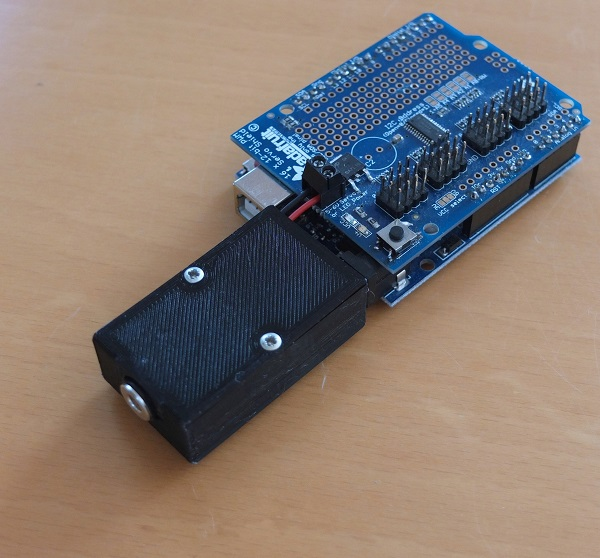

# Arduino Adafruit Servo Shield Power Module

This power module is designed for the Arduino Uno in combination with the Adafruit 16-Channel Servo Shield. The Adafruit Servo Shield is a great add-on to the Arduino. But it requires a second, 5V power supply. With this device, you still need a 5V power supply but no longer a separate 12V power supply to power the Arduino.

Inside it uses a step-up voltage converter. Whereas the Arduino requires 9V or 12V and only milliwatts, the servo motors require 5V and much more power. That is also why it is not possible to power a servo motor from the Arduino's 5V pin. I used the same approach in the [Two-Mode Server Tester](https://www.instructables.com/id/Two-Mode-Servo-Tester/) project.

I've built a couple of these modules for myself and I leave them mounted to the Arduinos / Servo Shields.  Before you start this project, make sure you have a 5V power supply with the right plug. There are so many (I don't know how many) different formats.

If you order on the internet, the cost of materials will be around 2 USD (the power supply not included).

### Supplies:

1 Power supply 5V/2A with 3.5/1.35mm DC plug

1 DC power socket plug 3.5/1.35mm

1 DC power male plug 5.5/2.1mm

1 Step-up DC-DC 5V to 12V converter (aka. DC-DC Booster)

2 Screw M2 x l10

3D Printer

Soldering Iron

10cm solid wire in two colors

## Step 1: 3D Printed Parts

As material I used PETG, 20% infill, 0.4mm Nozzle and 0.2mm layers.

## Step 2: Soldering

Solder a 2cm wire and a 6cm wire to the converter's VIN+ and VIN-. This is the 5V  line that will go directly to the servo shield.

Solder a 2cm wire to the converter's VOUT+ and VOUT-. This is the 12V voltage that will power the Arduino.

Solder the 3.5/1.35mm power socket to the wires that come from VIN. The longer leg is usually the minus. Don't forget to add the fixation ring first.

Solder the 5.5/2.1mm power plug to the VOUT. This plug is compatible to the Arduino's power socket.

## Step 3: Assembly

Insert the electronics. Rotate the fixation ring of the 5V power socket until it holds the socket in place. Push the 12V power plug into the notch.

Make sure the wires are nicely bended and you didn't produce a shortcut. Add the cover.

That's the Arduino Adafruit Servo Shield Power Module.